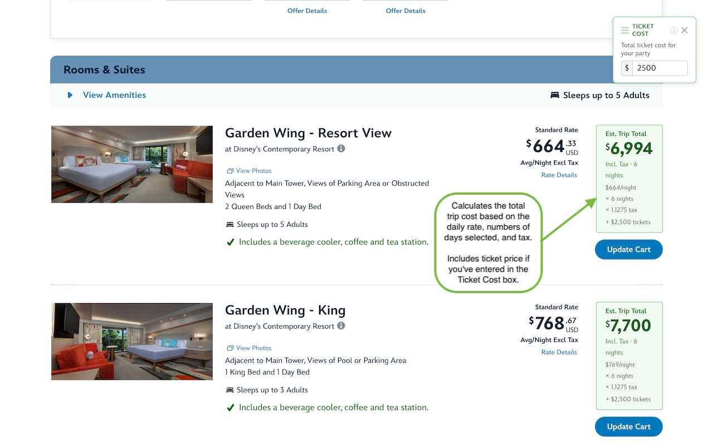

# Magic Numbers

A Chrome extension that helps you see the real cost of a Disney World resort stay — not just the nightly rate.

---

## What it does

When you're browsing Disney World resorts, the site shows a per-night price. Magic Numbers does the math for you and shows the **estimated trip total** (including tax) right on the page, based on your selected dates.

To get a better picture of the total price, there's a **ticket cost panel** where you can enter what you're spending on park tickets. Once you do:

- On **per-night price** cards, your ticket cost is added to the hotel total so you can see the full picture
- On **package price** cards (where Disney has bundled tickets in), your ticket cost is subtracted to reveal the effective nightly room rate

The ticket cost you enter is remembered as you browse between pages.

## How to use it

1. Go to the [Disney World resorts page](https://disneyworld.disney.go.com/resorts/) and select your check-in and check-out dates
2. Magic Numbers will automatically show estimated totals on each resort card
3. Enter your ticket budget in the **Ticket Cost** panel that appears in the top-right corner (you can drag it anywhere on the page)

## Cool, how do I use it?

- Install from the Chrome Web Store - (pending approval)
-
